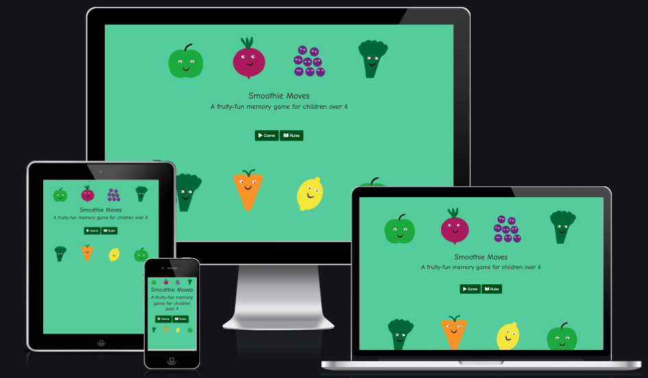
Smoothie Moves
==============

Smoothie Moves is a fruit and veg themed memory browser game for children. Its main aim is to encourage children to play a colourful, friendly and fun game on a device (most specifically a tablet) or computer. Its secondary aims are to carry positive messages about gameplay and fruit and vegetables!

 

[Play the live game here.](https://dandavies23.github.io/smoothie-moves/)

 

## Target audience

The game's initial target user was my daughter. I noticed when playing a physical memory card game that she was considerably better and quicker than me. She is at a stage in her learning development where her short term memory is excellent. Memory games help develop this.

As the game was developed and tested with family and friends’ children, it became clear that more children would enjoy this and more focus was given to score board and gaming capabilities. Based on this research and testing the user base could be 4-11 years old. A broader breakdown of these persona are follows.

### User Goals

1.  The ideal player is between 4-11 years old.

2.  They want a game which is colourful and stimulating.

3.  The want to play a fast and fun game which has a physical social element.

4.  They want to understand quickly how to play - even if they can’t read.

5.  They want to do better or beat their friends even if they can’t do maths.

 

### Parent or Guardian considerations

1.  The game should be universal with no sense of threat or violence.

2.  The game should carry a good wholesome message.

3.  The game should have a perceived educational or cognitive benefit. 

4.  The game should be sociable rather than over absorbing or insular.

5.  The game reminds them of computer / arcade games they played when young.

 

### Owner goals

1. Get pleasure from seeing children and adults playing the game.

2. Increase traffic to the web app and spread to friends.

3. Proritise organised considered though over speed. 

 

### User Stories

*As a game player*

1.  I want to understand what Smoothie Moves is.

2.  I want to easily orientate myself and get into the gameplay quickly.

3.  I want to get more information about the game but also feel I don’t have to read the rules to be able to play.

4.  I want the game to be fast and compelling.

5.  I want a read out of my progress whilst I’m playing.

6.  I want encouragement that I’m doing well.

7.  I want the ability to stop and start again if I’m losing.

8.  I want a final score and a visual indication of level of achievement.

9. I dont want to feel like learning is a chore.

## UX and UI

### Game Research

The main inspiration for this game is a physical card game that I play with my daughter. As I began my research it ocurred to me that there's quite a lot of online 'memory card’ games. Many of them which use the [CSS Flip Card](https://www.w3schools.com/howto/howto_css_flip_card.asp) effect, often used with Bootstrap. In August 2021 I also took part in a [Code Institute retro-gaming hackathon](https://hackathon.codeinstitute.net/teams/76/) and at the kick-off conference the organisers specifically requested “[no flip-card games!](https://youtu.be/MUHgm0B2h-s?t=1188)“. As I developed the game it became more important to consider the [cognitive benefits of memory games](https://www.theottoolbox.com/memory-card-games/) but for it to remain enjoyable. I considered a ["For Parents" button](https://github.com/dandavies23/smoothie-moves/issues/61) but decided it might be too school-like (see point 9 in user stories).

 

### Research Analysis

From a UX perspective my daughter had no interest in a skeoumorph representation of a flipping card. I wanted something more relevant to its intended audience. An early idea of creating a magicians hat with a hover wand was abandoned due size inconsistency. Then whilst thinking of a name and accidentally writing ‘pears’ instead of matching ‘pairs’ put the idea of fruit in my mind.

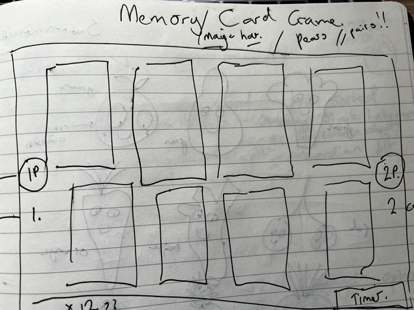

## Design

Although there has always been a slight question mark over how healthy smoothies are it occurred to me that the design could it perhaps with an educational lean. The idea emerged to create a game which gave equal balance to fruit and veg. One Sunday morning a selection of fruit and veg were audience suggested, sketched and tested with my daughter.

 
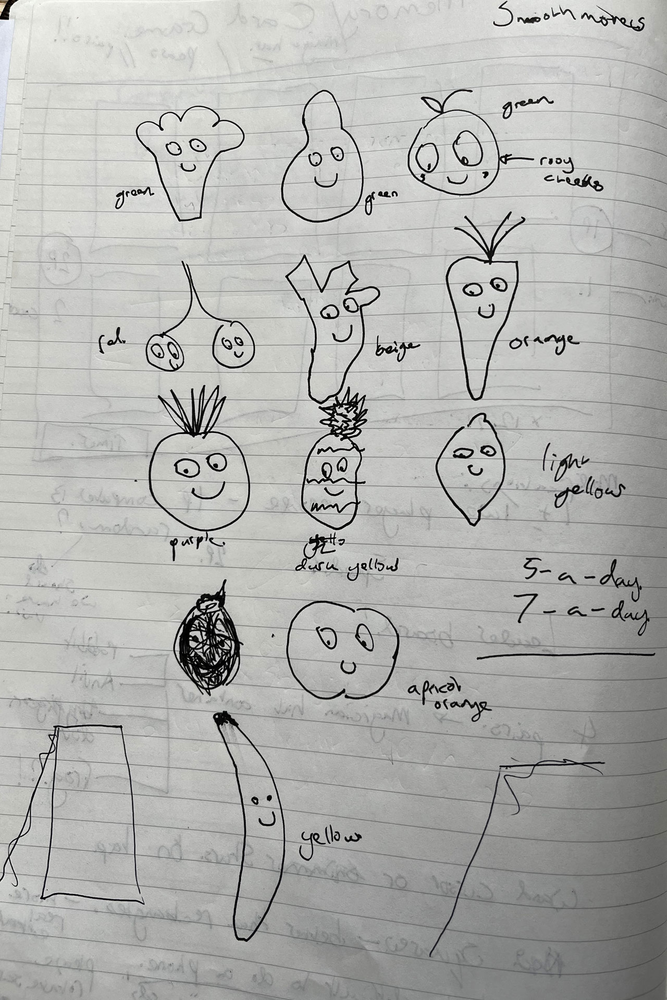

 

### Graphics (Fruit and veg)

The design considerations for the fruit and veg to bold solid shapes and for them to have a sunny outlook. This was the reason why ginger and apricot were rejected. Solid primary colours added a bold contrast. The favicon was resized in Adobe Photoshop [with guidance](https://webflow.com/blog/favicon-guide) to resize 32x32 to keep the apple sharp .

### Colour References

| Colour             | Hex                                                                |
| ----------------- | ------------------------------------------------------------------ |
| Lemon |  #f3e600 |
| Apple |  #3baa35 |
| Carrot |  #f39200 |
| Beetroot |  #00d1a0 |
| Broccoli |  #006533 |
| Blueberries |  #662483 |
| Cup|  #999999 |

A variety of colour (“drinking a rainbow”) was important to the game design. But for web acessibility reasons a [variety of shape](https://webaim.org/articles/visual/colorblind) was also important. The images were designed in Adobe Illustrator with the tumbler trapezoid as a separate layer so that the scale of the fruit could be authentic. At this point banana was rejected. 

 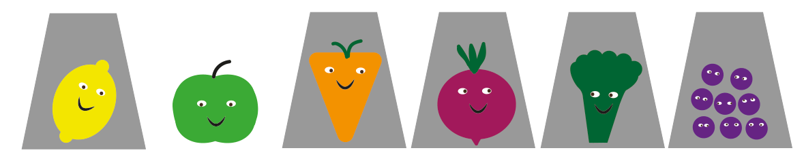

The original ‘gameboard’ was brown to resemble a chopping board but my mentor Askshat Garg suggested this actually darkened the game. The game’s main colour a light fresh green chimed with the health theme. Checking this background on [Coolor](https://coolors.co/contrast-checker/000000-66cc99) determined that the strongest font colour would be black. 

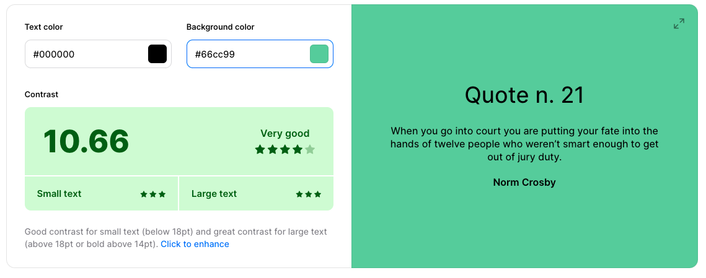
 
Coolors' contrast checker also helped make a decision on changing the standard Bootstrap Success colour to a darker hue to support a white font. 

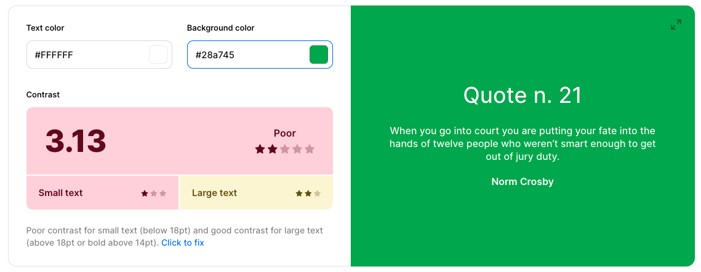

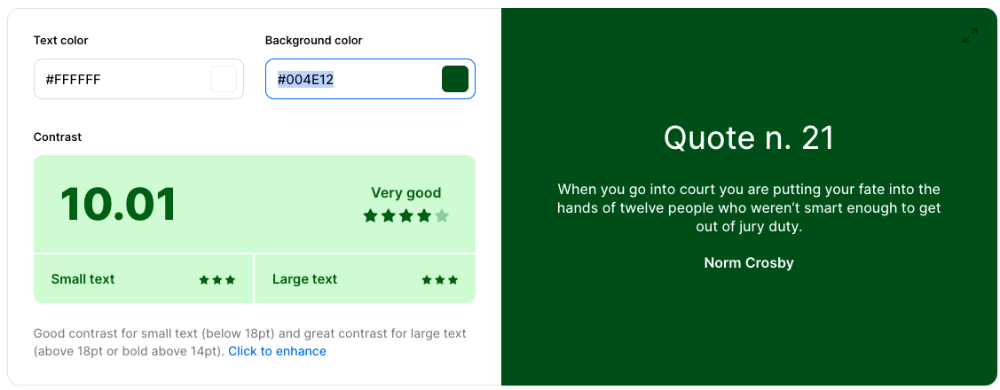

### Typography and tone

Careful consideration was given to the font. For children just learning to read and write I felt it was important to show letters that can be copied. Serif font was too formal whereas most fonts with a Helvetica root have difficult “a” characters. I wanted to originally to use ‘Schulbuch' but as the name indicates it's a bit "school booky". Instead, I went for 'Comic Neue’ a classier but still informal version of of 'Comic Sans'.

### Game skeleton and surface

I wanted the [browser game](https://en.wikipedia.org/wiki/Browser_game) to feel like an arcade game - rather than a website with a game embedded. In the early wireframe game play focus was on having the gameboard as prominent as possible. I also assumed that the game would largely played on mobile or ipad so optimised the space for this. 

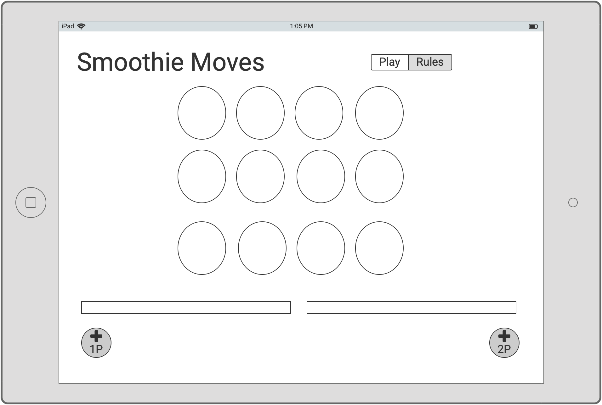

Note here in the early design there's a 2-player option. I like the retro game idea of the game being socialble so that the iPad or phone would be passed between players rather being absorbed entirely in the game.

A wireframe for desktop was also designed which has a header and footer. But the mobile version really cut down on the screen real estate. This became even more apparent when working on the start-screen where I made the decision to bring the title and start buttons centre screen to increase engagement and as a headnod to retro games. 

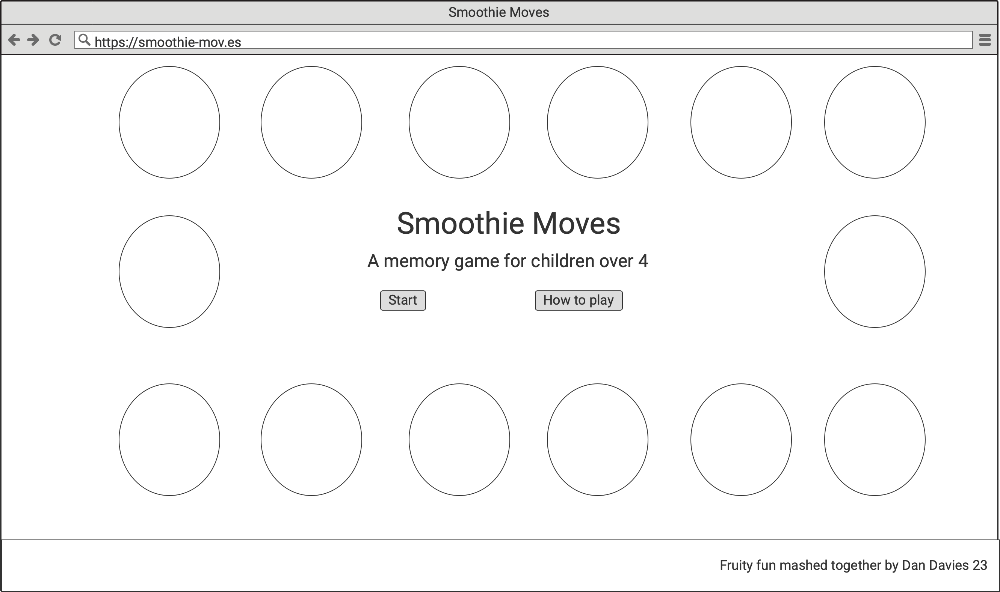

A full set of Wireframes are available to [view](https://www.dropbox.com/sh/obqgg6aahaonp0a/AADW6nz7zxHI8RmebMSOYO42a?dl=0) or [download](https://www.dropbox.com/sh/obqgg6aahaonp0a/AADW6nz7zxHI8RmebMSOYO42a?dl=1). 

It's very difficult to keep a game viewable and to let it fit on all screensizes. In testing responsiveness I made a decision that at least the game grid should fit on the screen so a child could focus on the game.

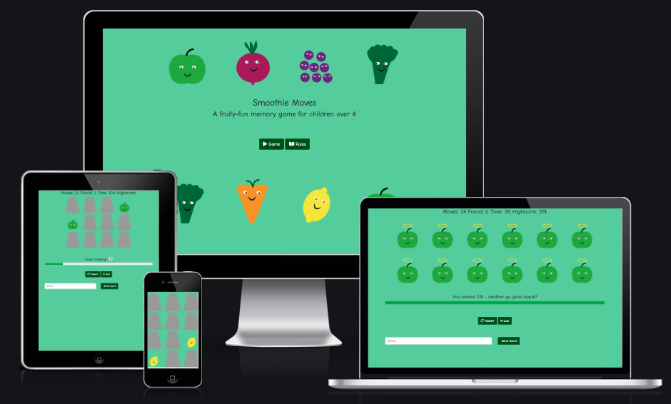

## Features

The main focus of this app is the game it being easy to view and play on any size mobile device. In addition to the game there is:

 

### Start screen

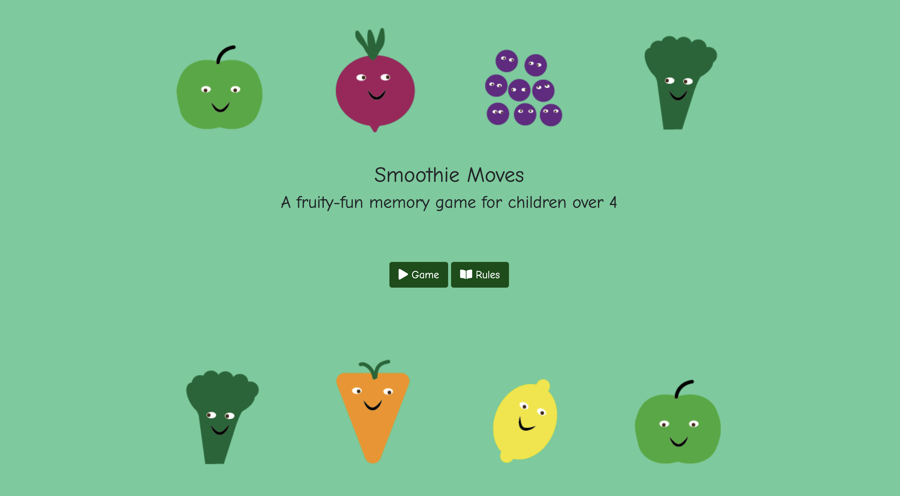

-   Title of game with a strap-line explanation. 
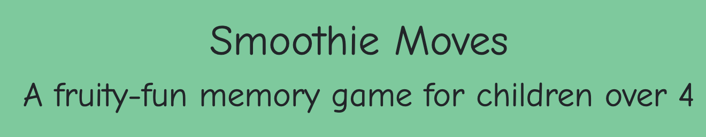

-   Clear centre-screen button navigation to game for arcade feel, with icons for visual support. Further aria description to avoid small screen resizing issue.

-   Button to modal for on page rules.

 

### Rules modal

-   No need to navigate away from main play loop.

-   Written in an easy to understand rules presented in a clear friendly tone.

- Hints that using you brain is more effective than speed.

 

### Game
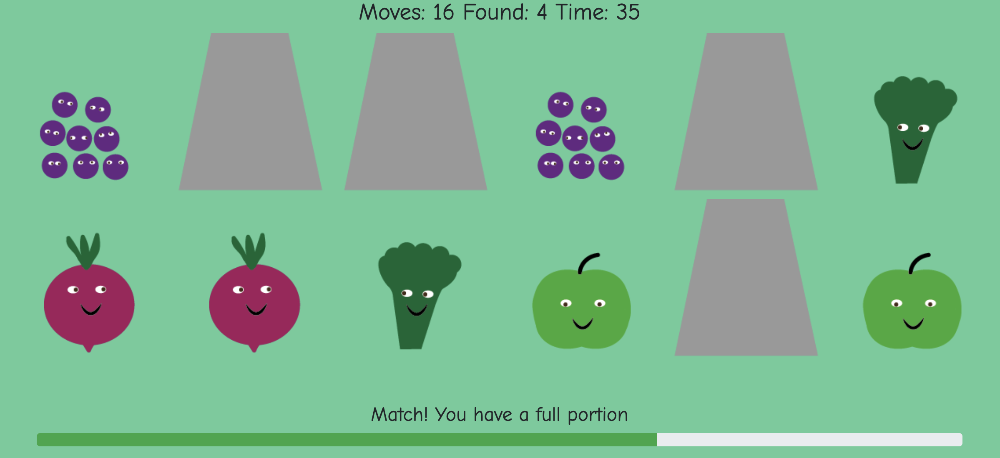

-   Optimised game grid for all devices 
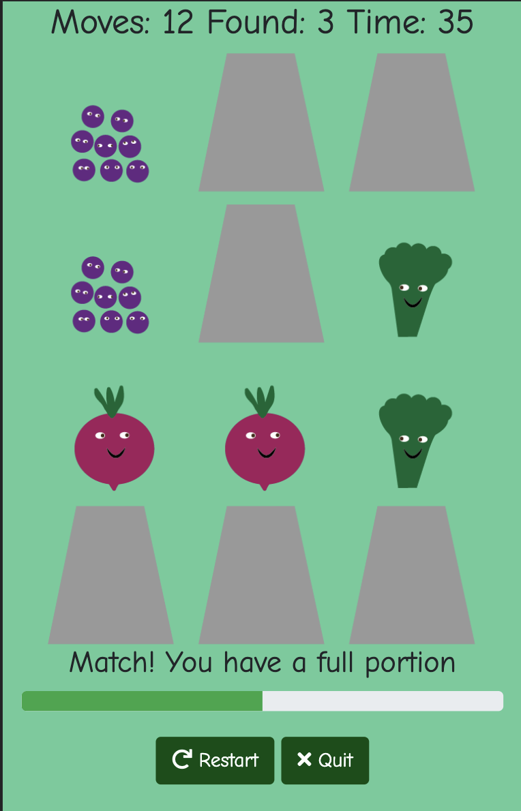

-   Progress read out with timer 

-   'Smoothie bar' to give visual indication of progress 

-   Nudge encouragement 

-   Simple quit or play again buttons 
 

-   Results layout with featured and message which encourages play at any level 
 

- Suprise rank badges to represent progress visually
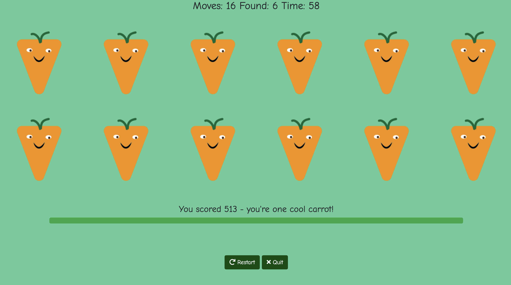

- Form capture for EmailJS 

- Receive more 'hint' guidance to game play
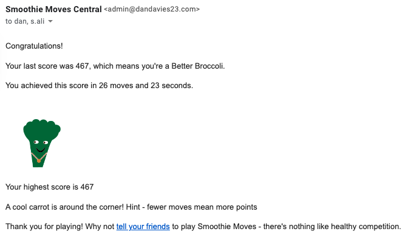
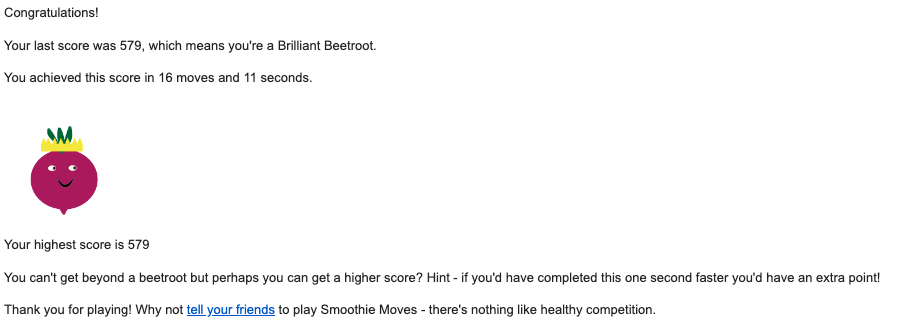

### Scoring and other game dynamics
To appeal to a broader age range I felt it was important to bring in a a scorebooard and rank. I identified 500 (Cool Carrot) as a good attainable target for a child with a well developed short term memory, visual attention and good organisation and prioritisation skills. 

Each correct move is 10 points and seconds are effectively 1 point. Which means it's better to make fewer mistakes than it is to make lots of mistakes quickly. In calculateScore this is subtracted from a 'calibration score' of 750. This can be raised to make it easier or lowered to make it harder.  

A user will score 550 (Brilliant Beetroot) if they have a logical system (18 moves) completed in 19 seconds or 16 moves in 40 seconds. Game hints delivered in the email and games instructions. So although the speed appears to be of the essence a good system (smoothie move) is given nurtured. Or you might be lucky... 

If you are ‘lucky’ you will stumble across a pair randomly which means that you can score over 550 (Brilliant Beetroot), This lucky stroke is a typical game play strategy, a system gets you so far but luck gets you even further. It means the user returns until they strike it lucky!

Email hints are useful to me because it means that I can collect data about how well this is going. This means that in later versions I can tweak the algo if too many people are scoring high quickly and build difficulty level into the game.

### Features to implement

**2-player mode**

-   device to have a ‘vs’ mode whoever finds the most veg first wins

-   ‘collaboration' mode would stop the clock and only start when you tap on a tumbler

**Choose you fruit and veg**

-   More fruit and veg options to add to or extend grid

-   Choices could also be a ‘gameset’ which would also have smoothie type name ’Strawberry delight’ etc

**Highest score and leaderboard**

-   Ability to enter name at High Score and display in traditional leaderboard. 

**Difficulty level** 

- User can choose hardness level in a toggle 1-5 which changes the calibration score by 50

Technologies used
-----------------

### Languages 

[HTML5](https://www.techradar.com/uk/news/internet/web/html5-what-is-it-1047393)

[CSS](https://www.w3.org/TR/CSS/#css)

[JavaScript](https://developer.mozilla.org/en-US/docs/Learn/JavaScript/First_steps/What_is_JavaScript)

 

### Frameworks, tools and software

[Bootstrap4](https://getbootstrap.com/docs/4.0/getting-started/introduction/)

[Google Fonts](https://fonts.google.com/specimen/Comic+Neue?query=Comic+Neue)

[Font Awesome](https://fontawesome.com/)

[Coolors](https://coolors.co/)

[Balsamiq](https://balsamiq.com/)

[Github](https://github.com/)

[Gitpod](https://gitpod.io/)

[Am I Responsive?](https://ui.dev/amiresponsive)

[Adobe Illustrator and Photoshop](https://www.adobe.com/uk/creativecloud.html)

[EmailJS](https://www.emailjs.com/)

 

Testing
-------

### Process

-   Throughout the development of this game Google Chrome’s Developer tools were used to check screen sizes and ratios including the smallest Moto to ensure single screen playability.  

-   Progress was detailed in commit messages with frequent pushes to Github.

-   A [Github project](https://github.com/dandavies23/smoothie-moves/projects/1) using a Kanban Board was created to organise development, track bugs and suggest enhancements.

-   Project was deployed early so colleagues, peers and user-testers could give feedback. Emails from users informed the calibration of the game.

-   A new and old full size iPads were used as well as a variety of iPhones: 6, X, 13

-   My daughter proved to be an excellent user-tester managing to break the first full prototype in about 30 second and therefore raise three bugs!

-   Game was tested on all devices and optimised for tablet as this is what children most use.

### User Stories Testing 

As a player

1.  I want to understand what Smoothie Moves is.

    -   On the homepage / start screen the name, strapline explain the point of the game quickly

    -   Rules add further clarification if needed.

2.  I want to easily orientate myself and get into the gameplay quickly.

    -   User journey is only two levels deep: start screen / game and result maintains the game grid (for speed and quick restart).

    -   Central play button is prominent and not hidden in any navigation convention

3.  I want to get more information about the game but also feel I don’t have to read them to be able to play.

    -   Play button is in primary (centre-left) position

4.  I want the game to be fast and compelling.

    -   Game is built in vanilla Javascript to make the game quick and nimble and with no JS library dependencies.

    -   The game's speed and time gives a sense of excitement and endorphin rush.  

    -   User has result screen option to continue play again rather than return to start screen: game / result loop

5.  I to understand my progress whilst I’m playing.

    -   Score offers statistical feedback 

    -   Progress bar is a visual equivalent

6.  I want encouragement that I’m doing well.

    -   Nudge message celebrates a match and encourages gamer to keep looking

7.  I want the ability to stop and start again if things aren’t going well

    -   Player can start the game at any point if it feels futile.

8.  I want a final score and a visual indication of level of achievement.

    -   Result screen has the calculated score and a character to indicate level of success.

9. I dont want to feel like learning is a chore.
    - Game has a nudge and hint dynamic
    - Encourages you to think before you move
    - Removed message to parents - it's important for children to have autonomy

Validation
----------

-   App passed with [W3 Validator](https://validator.w3.org/nu/?doc=https%3A%2F%2Fdandavies23.github.io%2Fsmoothie-moves%2F)
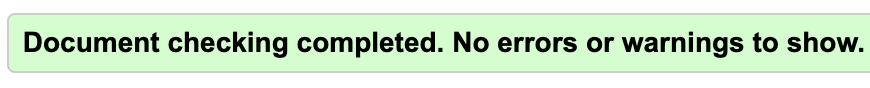

-   App passed with [CSS Validator](https://jigsaw.w3.org/css-validator/validator?uri=https%3A%2F%2Fdandavies23.github.io%2Fsmoothie-moves%2F&profile=css3svg&usermedium=all&warning=1&vextwarning=&lang=en)

-   Javascript errors were discovered using [JSHint](https://jshint.com/)

- No 'Problems' in Gitpod UI

- Scored highly in Chrome Developer Lighthouse report
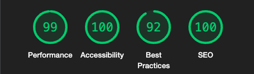
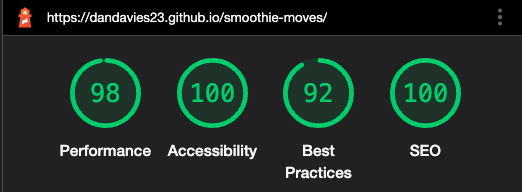

Bugs and Fixes
--------------

All significant bugs were flagged within the [Github project](https://github.com/dandavies23/smoothie-moves/issues?q=is%3Aissue+label%3Abug+is%3Aclosed). For speed these were often written in note form so a selection are written up in more detail here:

### Double click / tap results in ‘sticky' fruit selection

**Issue number:** 
[10](https://github.com/dandavies23/smoothie-moves/issues/10)

**Platform / OS:** 
Macbook Air and Pro Chrome, iPad 3rd gen, iPad 7th gen, PC

**Reproduce:** 
Play game at speed, tapping on more cups as quick as possible. JS gets confused and leaves unmatched pairs on screen. 

**Priority/Severity:** P1 - game is un-winnable. 

**Tried:**

-   Disabling area after tap, blank space (an image to preserve spacing) can still be tapped on. 

-   Made sure objects weren’t same. Previously blank spaces are named the same

`if (optionOneId == optionTwoId) {

            cards[optionOneId].setAttribute('src', 'images/tumbler.png')

            cards[optionTwoId].setAttribute('src', 'images/tumbler.png')

            alert("Slow down! You've already tapped that!")`

-   "if I click into an empty space the lemon is back"

"if I then select another fruit or veg it replaces the found lemon with a cup…"

**Solution:** Raised on Stackoverflow and followed up by “Y0ursTruly” on GitHub who suggested assigning “null” value. Also in conversation with mentor Akshat Garg to setAttribute to "data-disabled". 

**Status:** Fixed. Merged. [Later decided](https://github.com/dandavies23/smoothie-moves/issues/18) with mentor, that a better UX is to leave the fruit in situ.

 

### Time still running after game completion

**Issue number:**[ 45](https://github.com/dandavies23/smoothie-moves/issues/45)

**Platform:** All platforms

**Reproduce:** Finish game and watch time

**Priority/Severity:** P2 - no effective resolution to game

**Solution:** There was no proper end screen and calculation of score. Issue now resolved as EndTime is used to calculate and are variables are properly fixed.

 

### Mouse pointer doesn’t turn into finger

**Issue number:** [49](https://github.com/dandavies23/smoothie-moves/issues/49)

**Platform:** Desktop

**Reproduce:** Play game on desktop no visual indication of what you can click.

**Priority/Severity:** P3 - only affects desktop and game targeted to work best on mobile

**Solution:** Simple fix in CSS `.pointer { cursor: pointer; }`

 

### Emoji in nudge messages readable across all platforms

**Issue number:** [46](https://github.com/dandavies23/smoothie-moves/issues/46)

**Platform:** All platforms

**Reproduce:** Need to check that all platforms display emoji.

**Priority/Severity:** P3 - if character doesn’t display it probably will just appear as block.

**Solution:** Requires further testing but emoji seems to be pretty universal on [Am I Responsive?](https://ui.dev/amiresponsive?url=https://dandavies23.github.io/smoothie-moves/)

### Timer is not resetting on game restart
**Platform:** All platforms

**Reproduce:** Complete game restart and it doesn't fix.

**Priority/Severity:** P2 - game can be reset with browser or by quitting and starting again.

**Steps to resolve** 
1. Tried injecting "0" into HTML
2. Reset variables
3. Removed variable resets
4. Rewrote initialise timer function - deleted variable at run - suggestion by Pete Doyle
5. Removed all end of game resets
6. Looked at calculate game function
7. Identified 'time' variable which sounds like it might be universal
8. Removed variable and stuck to timeDiff
9. Timer kept going so fixed timeDiff = timeDiff
10. Created timeOver variable and added to game data map
 

Deployment 
-----------

To deploy this page to GitHub Pages from its [GitHub repository](https://github.com/dandavies23/smoothie-moves), the following steps were taken:

1.  From the menu items near the top of the page, select **Settings**.

2.  Scroll down to the **GitHub Pages** section.

3.  Under **Source** click the drop-down menu labelled **None** and select **Master Branch**

4.  On selecting Master Branch, the page is automatically refreshed, the website is now deployed.

5.  Scroll back down to the **GitHub Pages** section to retrieve the link to the deployed website.

 

To clone this project from GitHub:

1.  Under the repository name, click "Clone or download".

2.  In the Clone with HTTPs section, copy the clone URL for the repository.

3.  In your local IDE open Git Bash.

4.  Change the current working directory to the location where you want the cloned directory to be made.

5.  Type `git clone`, and then paste the URL you copied in Step 3.

~~~~~~~~~~~~~~~~~~~~~~~~~~~~~~~~~~~~~~~~~~~~~~~~~~~~~~~~~~~~~~~~~~~~~~~~~~~~~~~~
git clone https://github.com/dandavies23/smoothie-moves
~~~~~~~~~~~~~~~~~~~~~~~~~~~~~~~~~~~~~~~~~~~~~~~~~~~~~~~~~~~~~~~~~~~~~~~~~~~~~~~~

1.  Press Enter. Your local clone will be created.

Further reading and troubleshooting on cloning a repository from GitHub [here](https://help.github.com/en/articles/cloning-a-repository).

 

Technologies and Credits
------------------------

This project was built on the [Bootstrap 4 ](https://getbootstrap.com/docs/4.0/getting-started/introduction/)framework. 

All illustrations were created using Adobe Illustrator.

The main memory game was written in Javascript with the raw structure coming from a Walkthrough video by [Ania Kubow](https://www.youtube.com/watch?v=tjyDOHzKN0w). This video was a good reminder of many concepts I’d started to become familiar with in the module but this easy to follow video got the concepts across very well.

 

Acknowledgements
----------------

Thanks to my daughter for helping suggest the game dynamic user-testing and breaking the early version and exposing bugs! Thanks for me wife for giving me time and encouragement and help with colour schemes.

I’m really grateful for help on Stack Overflow for help with … Y0urs Truly (Paul Taylor) helped me squash a double tap bug that my daughter exposed, and suggested using the null value. I tweaked this code further used it elsewhere with the disable attribute. He also spotted a speed bug which stopped the game if the user tapped too many cards which stopped the game being achievable and suggested a simple <= rule which solved it. He picked up the localStorage idea suggested by my mentor and suggested an implementation which I half used then adapted.

I’m also grateful to Tim Stacy, a friend who gave invaluable advice in the latter stages of the first sprint and adding a persistent HighScore last minute this time around. 

Other resources I used were W3Schools for further tutorials on JS and JQ, Medium articles on localStorage by [Michael Karen](https://michael-karen.medium.com/how-to-save-high-scores-in-local-storage-7860baca9d68) and [Abhishek Srivastava](https://medium.com/swlh/a-complete-guide-to-localstorage-in-javascript-ef65098e5a36). Code Institute’s Slack channel and other CI people who have additionally helped me including tutors Sean Young and Dan G. Also student Tom Nagy who passed on a iPad none interference tip my first mentor Akshat Garg and my second mentor Antonio Rodgriguez for his enthusiasm about the project and getting EmailJS up and running. Finally, I want to thank all the children who enjoyed this game including extended cousins and friends - you're already super smart 🤓

_This browser game was created for Code Institute MS2 Interactive development course._ 

 
